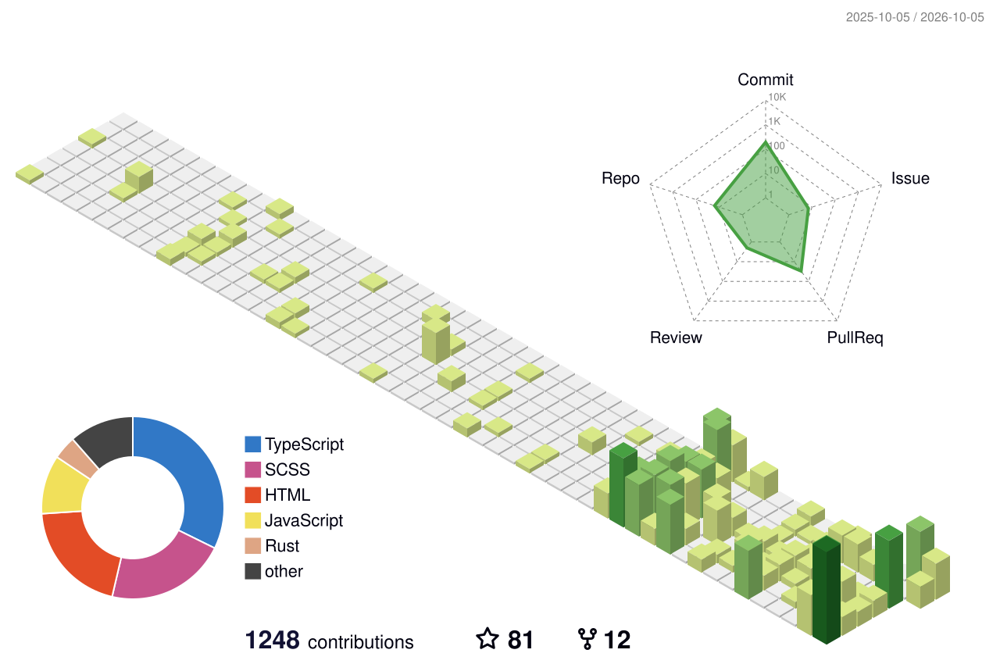

# Hi, I'm Yijie Xu 👋

I am a **Ph.D. Candidate in Artificial Intelligence** at [The Hong Kong University of Science and Technology (Guangzhou)](https://www.hkust-gz.edu.cn/), advised by **Prof. Hui Xiong**.

I am currently a **Research Intern at Tencent**, working on **generative retrieval**.

My research studies how language models **acquire and leverage information to adapt and make decisions**, with a particular focus on:

- 🔄 **Test-time Self-Evolution**
- 🔎 **Generative Retrieval**
- 📚 **Retrieval-Augmented Generation**
- 🧠 **LLM Post-Training and Adaptation**

For publications and more details, please visit my [homepage](https://yjx.me/) or [Google Scholar](https://scholar.google.com/citations?user=hBZs76kAAAAJ).

[**Homepage**](https://yjx.me/) ·
[**Google Scholar**](https://scholar.google.com/citations?user=hBZs76kAAAAJ) ·
[**CV**](https://yjx.me/cv/) ·
[**Email**](mailto:yxu409@connect.hkust-gz.edu.cn)

I am open to **industry research opportunities in LLM post-training and related areas**.

---

## GitHub Stats

  
  

  

  <picture>
    <source media="(prefers-color-scheme: dark)" srcset="https://raw.githubusercontent.com/yeahjack/yeahjack/output/github-snake-dark.svg" />
    <source media="(prefers-color-scheme: light)" srcset="https://raw.githubusercontent.com/yeahjack/yeahjack/output/github-snake.svg" />
    
  </picture>

  

